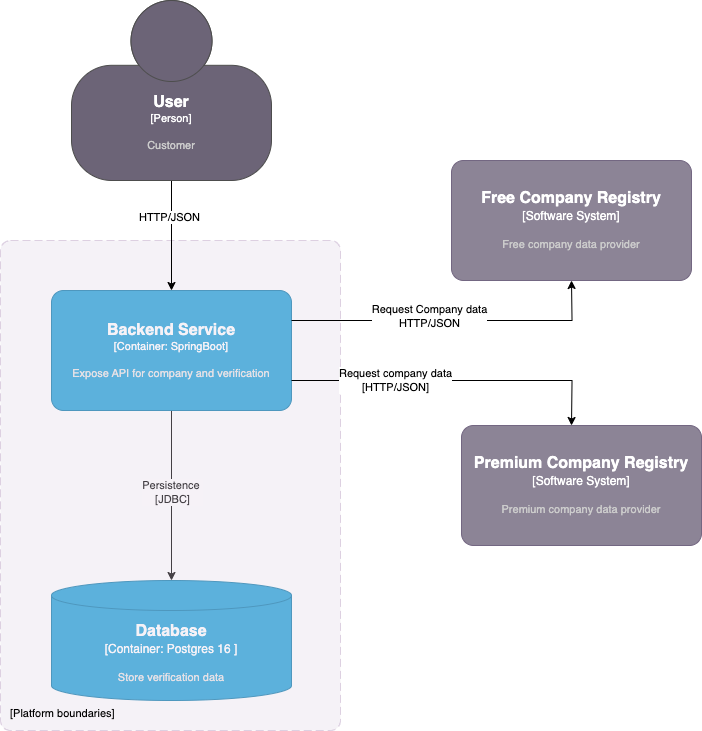

# Backend Service

### Repositories
Project contains four repositories:
* [Backend service](https://github.com/aleksandarnikolic84/backend-service) - Handle Backend and Verification APIs,
  communicate with Company Registry service
* [Company Registry service](https://github.com/aleksandarnikolic84/company-registry-service) - Simulate work of 
  free and premium api with data stored in database.
* [Company Registry schema api](https://github.com/aleksandarnikolic84/company-registry-service-api-schema) - 
  OpenApi schema definition for APIs exposed by Company Registry service (free & premium)
* [Backend service schema api](https://github.com/aleksandarnikolic84/backend-service-api-schema) -
  OpenApi schema definition for APIs which are exposed on Backend service

### Design Explanation
* **Package isolation**: Every layer has api subpackage for better isolation and loosely couping of packages. 
* **Third party communication**:  Communication with third-party services is managed in a separate package 
  with a uniform interface and implementation, encapsulating implementation details.
  Logic is under package `server/src/main/java/com/incode/backendservice/external/api/company`
* **Chain of Responsibility**: For third party call, choreography variation of Chain Of Responsibility 
  with Template pattern is chosen. Using this approach if third company provider appears it will be integrated smoothly.
  This logic is under package `server/src/main/java/com/incode/backendservice/dataprovider/company`
* **Facade layer**: Acts as an orchestrator between the company and verification layers to prevent mixing of domains.
* **Code uniformity**:
  * For keeping code uniform checkstyle & PMD plugin are added
  * To have better architecture ArchitectureFitness test measure code quality. 
  Also, `depenenices diagaram` is added which can help to keep clear architecture based on previously explained
  package structure.

### ADRs documentation section

Architecture Decision Records (ADRs) are documented in the [ADR](doc/adr/001-initial-design.md) folder. 
Includes related diagrams to illustrate the current architecture.

### Container diagram



### Used technologies
* Backend framework: SpringBoot 3.3.6
* Language: Java 21
* Build tools: Maven, Gradle
* Testing: TestContainers, Mockito, RestAssured & WireMock

### Prerequisites
Ensure the following are installed:

* Installed Docker
* Installed Maven
* Installed Gradle

### Building and running the application

Use the `startup.sh` script to build and run the application:
```
./startup.sh
```
The script:
* build four repositories with test execution 
* create docker images 
* run images using `dokcer-compose`

With following scrip project can be stopped:
```
./shutdown.sh
```
 **Note:**
 If you encounter permission issues with the scripts, resolve them using the following command:
```
chmod +x shutdown.sh 
```

#### Building single repo
```
mvn clean install
```

## APIs Documentation & Examples

API documentation is available via Swagger Ui:
* [backend-swagger-ui](http://localhost:8080/api/swagger-ui/index.html)
* [company-registry-swagger-ui](http://localhost:8085/api/swagger-ui/index.html)

API examples can be found in doc/postman directory postman where can be found `postman` collection.

##### Steps for testing APIs from Swagger:
* Call API to get company data: [Swagger Ref](http://localhost:8080/api/swagger-ui/index.html#/companies/findCompanies)
* Check verification based on verificationId from previous api: [Swagger Ref](http://localhost:8080/api/swagger-ui/index.html#/verification/getVerification)


## TODO
* Cover all layers with tests
* Add Circuit Breaker - Resilient4J
* Add Rate limiter  - Resilient4j
* Handling security
* CI/CD Pipelines
* Add Observability & Monitoring
  * OpenTelemetry + Micrometer
  * Prometheus + Grafana
  * OpenTelemetry Collector with Jaeger/Datadog
  * Sentry for error tracking
* Variables which are hard coded should be exposed through `application.yaml`
* Improve logging


### Project clarification
Project tried to follow requirement which lead to some solutions which is maybe not the best choice. 
In real-world scenario, additional clarification and session with Product team would be conducted 
to refine the approach.

## Author
**Aleksadnar Nikolic**
