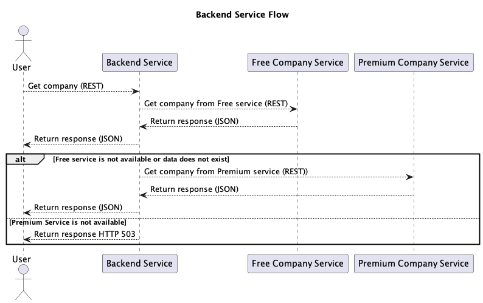

# 1. Initial Design

Date: 2024-12-29

## Status

Accepted

## Context

The goal is to design and implement a backend service with multiple API endpoints. This service will:

* Interact with two third-party services (FREE and PREMIUM APIs).
* Handle errors gracefully and provide fallback mechanisms.
* Return company data to end users in a structured format.
* Store and retrieve verification logs for auditing or tracking purposes.

The design aims to meet these requirements while serving as a proof of concept to initiate further discussions on scalability, extensibility, and maintainability.

## Decision

Two services will be created to fulfill the requirements:
1. **Backend Service:**

   * Provides two primary endpoints:
     * GET /backend-service: Retrieves company data based on user query.
     * GET /verifications: Fetches previously stored verifications by ID.
   * Handles third-party fallback logic:
     * Calls FREE Third Party API first.
     * Falls back to PREMIUM Third Party API if the FREE API fails or returns no results.

2. **Company Registry Service:**

   * Implements:
     * GET /free-third-party: Serves company data in snake_case format with a 40% failure simulation.
     * GET /premium-third-party: Serves company data in camelCase format with a 10% failure simulation.

The following sequence diagram illustrates the primary flow for the Backend Service:

## Consequences

With this design in some scenario, where third parties are not currently available client will not be able to get data 

